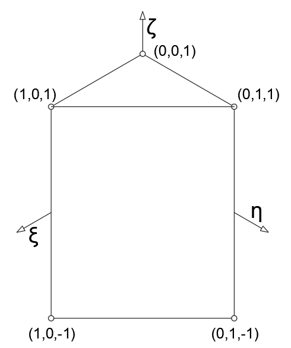
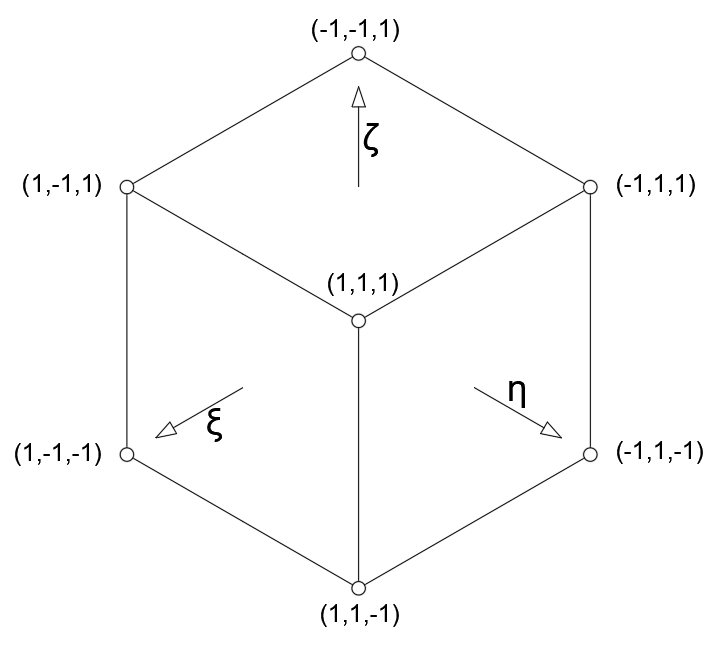

# cppfea: C++ Finite Element Analysis from scratch

The utility allows performing Finite Element Analysis of 2D and 3D meshes. Currently, it supports the following elements:
- Cuadrilateral: C2D4.
- Triangular Prism: C3D6.
- Hexadron: C3D8.

The classes allow triangulation of the point clouds, and the computation of the Strain Energy of the resulting mesh or meshes. 

### Dependencies
- Eigen3: linear algebra operations.
- PCL: point cloud processing and visualization.

### Description

The program assembles the Stiffness Matrix and computes the Strain Energy using the known Force vector. 

The only dependency is Eigen3, used for linear algebra operations.

The goal of the class is to be integrated in other projects, with this repository being used for testing purposes only. Information about elements and connectivity must be provided beforehand, we present examples of the data required for each element in the data folder.

Once in production, the class will be embedded in a non-linear optimization process. Taking corresponding 3d reconstructions of deformed possitions of the same scene. The goal is to minimize the Strain Energy between the two meshes, and thus, find the transformation that better aligns the two meshes.

## Usage

### Compile

<pre class="prettyprint lang-bsh">
<code class="devsite-terminal">git clone https://github.com/icirauqui/cppfea.git</code>
<code class="devsite-terminal">cd cppfea</code>
<code class="devsite-terminal">mkdir build</code>
<code class="devsite-terminal">cd build</code>
<code class="devsite-terminal">cmake ..</code>
<code class="devsite-terminal">make -j$(nproc)</code>
</pre>

### Run

<pre class="prettyprint lang-bsh">
<code class="devsite-terminal">./fem_analysis</code>
</pre>

### Example

When running the application as instructed in the previous section, the following output is expected:

1. A set of 3d points is loaded from disk.
2. Two finite element model objects (FEM) are initialized, the first with the loaded points, and the second with the same points but with random noise.
3. Triangulation is performed in the first model, and copied to the later, so both models have the same connectivity. An estimated pose is computed for each model.
4. The second pose is transformed, so the points are displaced and rotated.
5. Initialize Finite Element Analysis object (FEA) and compute stiffness matrix using node conectivity.
6. Simulate 5 steps in which the second model is displaced and rotated, closing to the first one. In each step, strain energy is computed comparing the possition of corresponding nodes between models.

## Sources

The utility is based on the following classes:
- `FEM`: Finite Element Model.
- `FEA`: Finite Element Analysis.
- `POS`: Tracks Pose transformations.

## About

The class has been used for processing non-rigid environments in Computer Vision algorithms:
 - Visual SLAM: [ORB-SLAM2-E](https://github.com/icirauqui/ORB_SLAM2_E.git).
 - Alignment of Point Clouds from NRSfM: [MeshMeld](https://github.com/icirauqui/meshmeld.git).

In the former we present a validation of the class results against Abaqus, a commercial Finite Element Analysis software. 
